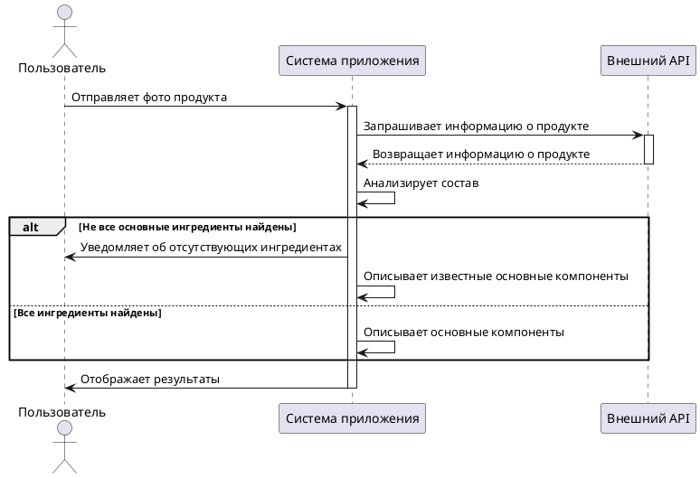
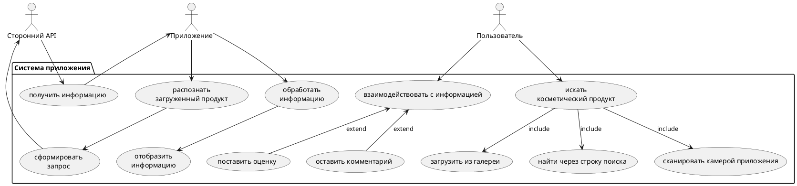

# UML Диаграммы и Алгоритм

## Алгоритм взаимодействия системы

### Описание:
1. Пользователь отправляет фото косметического продукта.
2. Приложение запрашивает информацию о продукте через внешний API.
3. API возвращает данные о продукте.
4. Система анализирует состав продукта:
   - Если не все основные ингредиенты найдены:
     - Уведомляет пользователя об отсутствующих данных.
     - Отображает известные компоненты.
   - Если все ингредиенты найдены:
     - Формирует описание всех компонентов.
5. Результаты отображаются пользователю.

### Используемый стек технологий:
- **Apache Kafka**: Асинхронная обработка данных.
- **Внешний API**: Для получения информации о продукте.
- **PlantUML**: Для визуализации процессов.

---

## sequence diagram

## use case diagram

